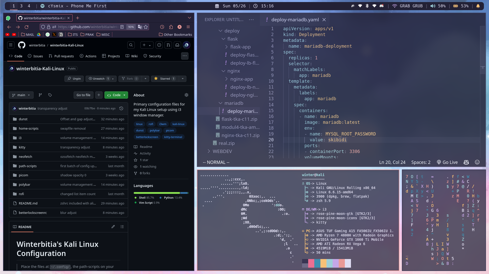
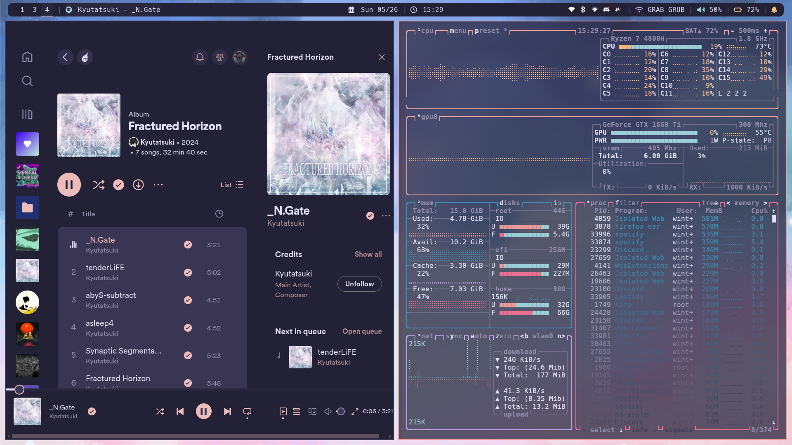

# Winterbitia's Kali Linux Configuration

> Place the files at `~/.config/`, the path-scripts on your `$PATH`, and the home-scripts on your `$HOME`

These are the main configurations used for my **Kali Linux** setup. Unfortunately, a lot of the directory paths have to be tuned for use with other devices, and certain scripts have to be moved to the `$PATH` for some of these configurations to function properly. *(I'm looking at you, the 3 line script to reset picom.)* Other than that, it should be clean and usable enough for my first time ricing a linux distro. Available configurations include:
* i3wm
* picom [(jonaburg's fork)](https://github.com/jonaburg/picom)
* polybar
	* [popup-calendar](https://github.com/polybar/polybar-scripts/tree/master/polybar-scripts/popup-calendar)
	* [polybar-spotify](https://github.com/Jvanrhijn/polybar-spotify)
* dunst
* kitty
* rofi
* neofetch
* betterlockscreen
* $PATH scripts used
    * [rofi-wifi-menu](https://github.com/ericmurphyxyz/rofi-wifi-menu)
    * [rofi-power-menu](https://github.com/jluttine/rofi-power-menu)
    * picomreset
* $HOME scripts available
	* .vimrc
	* .zshrc

## Notable Dependencies

While these services don't neccessarily contain configuration files, they're very crucial in my setup to install on my window manager to have it running properly.
* i3-gaps
* kali-desktop-xfce
* lxpolkit
* feh
* [Nerd Fonts](https://www.nerdfonts.com/font-downloads):
    * DejaVu Sans Mono
    * Hack

## Rose Pine Themes

**Rose Pine Moon** is one of the few color schemes I looked at for a short while and instantly fell in love with, to the point where I've used the scheme in many of my applications. You can find the themes listed in their [website](https://rosepinetheme.com/).

Used Themes [CLICK TO OPEN]

* btop
* cava
* Firefox
* GTK
* kitty
* Polybar
* Rofi
* Spicetify
* Visual Studio Code
* Wallpapers
* YouTube

## Gallery

